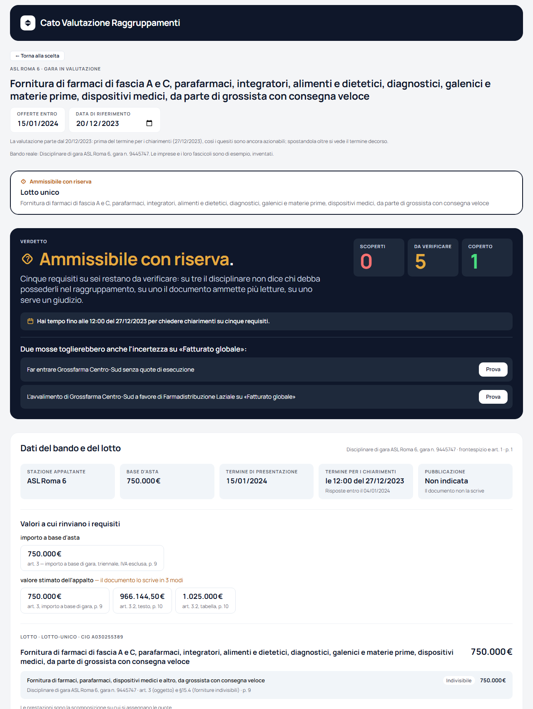
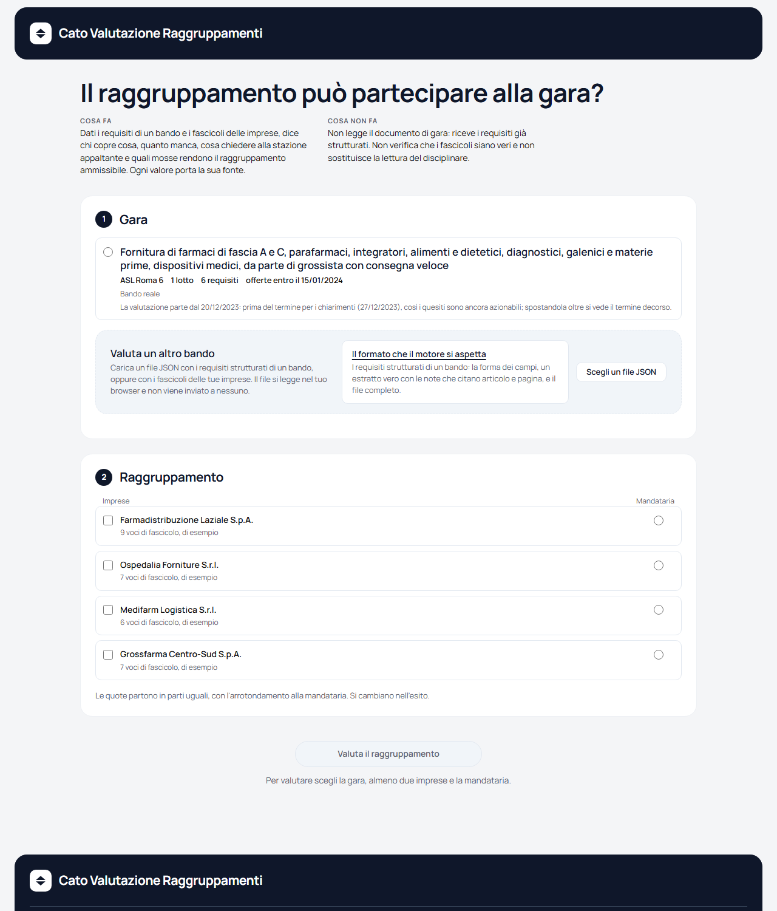
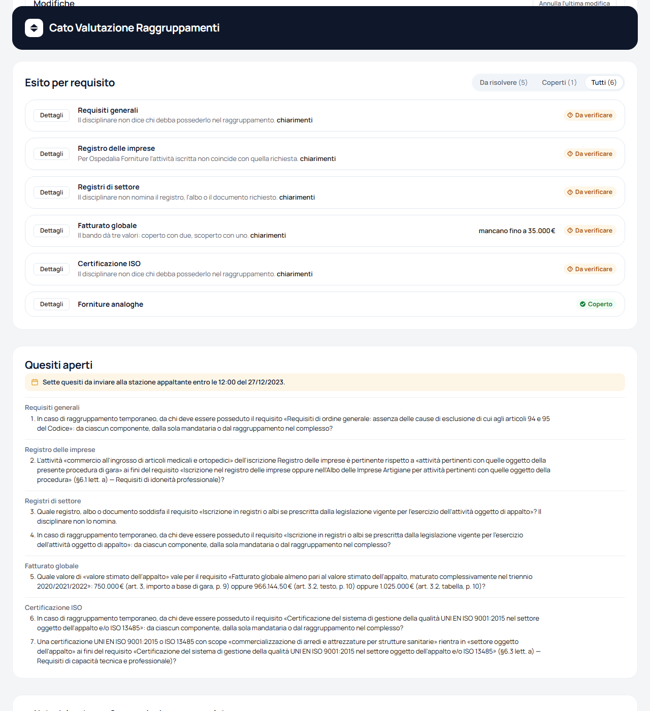

<div align="center">

# Cato Valutazione Raggruppamenti

**Il raggruppamento può partecipare alla gara?**

Dato un bando pubblico con i suoi requisiti di partecipazione e un raggruppamento
temporaneo di imprese con i rispettivi fascicoli, lo strumento dice **chi copre cosa,
quanto manca in numeri e cosa fare per diventare ammissibili**, con la provenienza
di ogni valore e le assunzioni dichiarate.
E quando il documento di gara non decide, lo dice, invece di scegliere in silenzio.


</div>

> **Progetto personale a scopo dimostrativo**, non affiliato ad alcuna azienda né a
> nessuna stazione appaltante. Il bando è reale e letto da un documento pubblico; le
> imprese e i loro fascicoli sono inventati, e la pagina lo dichiara.

---

## Indice

- [In breve](#in-breve)
- [Come si usa](#come-si-usa)
- [Il caso reale](#il-caso-reale)
- [Cosa fa](#cosa-fa)
- [Cosa non fa](#cosa-non-fa)
- [Come ragiona il motore](#come-ragiona-il-motore)
- [I documenti](#i-documenti)
- [Architettura](#architettura)
- [Avvio e sviluppo](#avvio-e-sviluppo)
- [Test](#test)
- [Privacy](#privacy)

---

## In breve

Un'impresa da sola spesso non ha tutti i requisiti di una gara pubblica. Si presenta
allora in **raggruppamento temporaneo** con altre, e la domanda diventa: *messi
insieme, i nostri fascicoli coprono ciò che il disciplinare chiede?*

Rispondere a mano vuol dire incrociare sei requisiti con quattro imprese, tre bilanci
ciascuna, certificazioni con una scadenza, referenze con un CPV e una finestra
temporale, quote di esecuzione, avvalimenti. E scoprire che il documento di gara, in
più punti, **non dice** come si compone un requisito tra i membri, o scrive lo stesso
valore in due modi nella stessa pagina.

Questo strumento fa quel lavoro e lo mostra in una pagina sola: il verdetto in alto,
una riga per requisito con il contributo di ogni membro e quanto manca, i quesiti da
inviare alla stazione appaltante, le mosse che renderebbero il raggruppamento
ammissibile. Ogni numero porta articolo e pagina del documento da cui viene.

<p align="center">
  
</p>

---

## Come si usa

La pagina si apre sulla **scelta**, non su un esito.

1. **Gara.** Si sceglie un bando tra quelli disponibili, oppure se ne carica uno dal
   proprio computer nel formato del motore. La pagina propone una data di riferimento
   e dice perché.
2. **Raggruppamento.** Si spuntano le imprese e si indica la mandataria. Le quote di
   esecuzione partono in parti uguali e si cambiano nell'esito.
3. **Esito.** Il verdetto, i dati del bando, la composizione da manipolare, una riga per
   requisito, i quesiti aperti e le note del motore.

Nell'esito ogni modifica al raggruppamento (quote, membri, ausiliarie, data di
riferimento) rivaluta tutto subito. I rimedi si **provano** come modifiche annullabili,
con un'etichetta onesta nella storia: niente viene applicato alle spalle di chi guarda.
Tornare alla scelta non butta il lavoro; si riparte da capo solo se cambia la gara.

<p align="center">
  
</p>

---

## Il caso reale

Il bando disponibile è la gara **ASL Roma 6, n. 9445747**: fornitura di farmaci e
dispositivi medici da parte di grossista con consegna veloce, monolotto, base d'asta
750.000 €. È letta dal disciplinare di gara pubblico, con articolo e pagina per ogni
valore.

Il disciplinare rompe un modello ingenuo in sette punti, e non con requisiti esotici:
con l'**indeterminatezza**.

| Cosa dice il documento | Come lo rappresenta il modello |
|---|---|
| Tre requisiti su sei non dicono come si posseggono nel raggruppamento | Regola di composizione `non_dichiarata`: il requisito è **da verificare** e nasce un quesito |
| La soglia del fatturato rinvia al "valore stimato dell'appalto", scritto in tre modi | Un valore del bando con tre **candidati**, ciascuno con la sua fonte; il motore valuta sotto ciascuno |
| "Forniture analoghe di importo non inferiore alla base d'asta" ammette due letture | Due **letture** dello stesso requisito: contratto singolo o somma dei contratti |
| "Ultimo triennio" senza dire da quando | Finestra **ancorata** al termine di presentazione, dichiarata come assunzione |
| La data di pubblicazione non compare mai | Campo assente; un ancoraggio che la richiede diventa un'anomalia |
| "Iscrizione in registri o albi se prescritta" senza nominare il registro | Criterio **non determinato**: il quesito lo chiede alla stazione appaltante |
| Lo scope della certificazione ISO non coincide con quello richiesto | **Giudizio** richiesto, con l'indicazione di chi può darlo |

Sulla gara reale, con tre imprese di esempio, l'esito è **ammissibile con riserva**:
cinque requisiti su sei restano da verificare, con sette quesiti da inviare entro il
termine per i chiarimenti.

<p align="center">
  
</p>

---

## Cosa fa

- **Valuta un raggruppamento contro un lotto.** Verdetto (ammissibile, con riserva,
  non ammissibile), una riga per requisito con il contributo reale di ogni membro, il
  delta in numeri, la motivazione in italiano, le fonti.
- **Distingue "non possiede" da "possiede ma non conta qui".** Chi ha una
  certificazione senza eseguire la prestazione non è una mancanza.
- **Soglie per rinvio e valori contraddittori.** Una soglia può rinviare per nome a un
  valore del bando, e un valore può avere più candidati. Esiti uguali sotto ogni
  candidato: l'esito vale, mostrando la misurazione peggiore. Esiti diversi: da
  verificare, con cosa succede sotto ogni lettura.
- **Letture alternative di un requisito.** Stesso meccanismo dei candidati, applicato al
  testo.
- **Ancoraggio non dichiarato.** Una finestra "a ritroso" senza dies a quo si ancora
  al termine di presentazione, dichiarata come assunzione, con i giorni di arretramento
  che cambierebbero l'esito.
- **Avvalimento.** Le ausiliarie integrano il fascicolo di un membro specifico, solo per
  i requisiti indicati e solo se il disciplinare li dichiara avvalibili.
- **Anomalie come dati, non eccezioni.** Mandataria assente, quote che non tornano,
  riferimenti inesistenti, rinvii a valori che il bando non nomina. Le bloccanti forzano
  il verdetto; le segnalazioni no.
- **Avvisi di scadenza.** Documenti validi oggi che scadono prima del termine di
  presentazione o entro un orizzonte, distinti dalle scoperture.
- **Rimedi verificati.** Un rimedio è proposto solo se, applicato a una copia
  dell'input, la rivalutazione lo conferma. La richiesta di chiarimenti è l'eccezione:
  non cambia i dati, ma dice se il termine per chiederli è già decorso.
- **Percorso minimo.** La sequenza più breve di mosse che porta ad ammissibile; se
  irraggiungibile, a con riserva, dichiarando cosa resta.
- **Confronti.** Lo stesso raggruppamento su ogni lotto; la composizione attuale contro
  quella prima dell'ultima prova.
- **Documenti dal proprio computer.** Un bando o dei fascicoli nello stesso formato si
  caricano e si valutano nel browser. Un file con la forma sbagliata resta nell'elenco
  con i suoi errori, ciascuno con il percorso del campo, cosa ci voleva e cosa c'è.

## Cosa non fa

Sui requisiti generali verifica che la dichiarazione esista, non che sia vera. Non
giudica equivalenze. Non modella la certificazione del produttore né quella in corso
di rilascio, le imprese con meno di un anno di attività, i consorzi come entità, le
reti e i GEIE, la garanzia provvisoria e le sue riduzioni, la comprova tramite FVOE,
l'offerta tecnica, gli adempimenti (DGUE, PASSOE, contributo ANAC, registrazione alla
piattaforma, self cleaning, divieto di partecipazione plurima). Non tratta il
subappalto.

**Non legge il PDF del disciplinare**: i requisiti arrivano già strutturati, e
l'estrazione dal documento è fuori dal perimetro per scelta. Non sostituisce la lettura
del documento. La pagina lo dichiara in fondo a ogni esito, nelle note del motore.

---

## Come ragiona il motore

**Il motore non conosce il diritto degli appalti.** Ogni requisito porta con sé due
dati letti dal disciplinare:

- le **letture**: quali fatti del fascicolo lo soddisfano, una o più se il testo ammette
  più interpretazioni;
- la **regola di composizione**: come quei fatti si compongono tra più soggetti.
  Ciascun membro, somma dei membri, chi esegue una prestazione, almeno un membro,
  oppure *non dichiarata*, se il documento tace.

Il motore applica quattro operatori a quei dati. Nessuna soglia, finestra, minimo per
ruolo o avvalibilità è scritta nel codice: arrivano dal disciplinare come dati, e la
famiglia del requisito (generale, iscrizione, economico, certificazione, referenza) è
puramente descrittiva.

### Tre stati, non due

`coperto`, `scoperto`, `da_verificare`. Il terzo non è un giallo decorativo: è il
motore che dichiara di non poter decidere, e dice perché con un elenco di
**indeterminatezze** di due famiglie.

- **Il documento non lo dice.** Regola non dichiarata, criterio non determinato,
  letture discordanti, valore contraddittorio. Si chiedono chiarimenti alla stazione
  appaltante, entro il termine del bando.
- **Serve un giudizio.** Uno scope, un'attività, un CPV che non coincidono. Decide chi
  può: la stazione appaltante, se il dubbio è su cosa significa il suo documento; il
  concorrente, se il dubbio è su cosa c'è nel suo fascicolo.

Un requisito può averle entrambe: sulla gara reale la certificazione ISO le ha tutte e
due.

### Assunzioni dichiarate

Quattro regole sono del motore e non del disciplinare. L'esito le espone per codice e
l'interfaccia le raccoglie in una legenda.

| Assunzione | Cosa fa |
|---|---|
| Arrotondamento per eccesso dei minimi per ruolo | "40 % di 3 referenze = 1,2, quindi almeno 2". Si sbaglia dalla parte che costa meno. |
| Classe CPV | Un servizio il cui CPV non condivide le prime *n* cifre con quello di gara non è analogo; *n* è un dato del criterio. |
| Ancoraggio al termine di presentazione | Una finestra a ritroso senza dies a quo parte dall'unica data certa del bando. La nota dice di quanto potrebbe arretrare senza cambiare chi conta. |
| Esito concordante | Con letture o candidati diversi nel testo ma concordanti nell'esito, l'esito vale; dove i numeri differiscono si mostra la lettura peggiore. |

### Una funzione pura

Il motore è `valuta(parametri) → Esito`: nessun I/O, nessuna data implicita, nessuna
mutazione. La data di riferimento è un parametro, e spostandola si vede un certificato
scadere o un termine per i chiarimenti decorrere. La ricerca dei rimedi e del percorso
minimo richiama la stessa funzione su copie dell'input, per cui ogni mossa proposta è
per costruzione una mossa che funziona.

---

## I documenti

Bandi e fascicoli non sono nel codice: sono file JSON in
[`public/documenti/`](public/documenti/), che l'applicazione carica all'avvio.
[`indice.json`](public/documenti/indice.json) elenca quelli disponibili; per
aggiungere un bando basta il suo file e una voce nell'indice.

Il formato è il formato di ingresso al motore: **requisiti strutturati**, prodotti a
valle dell'estrazione dal documento di gara. Ogni documento dichiara in testa cosa è
(`formato`) e da dove viene (`provenienza`, reale o di esempio): la dichiarazione sulla
pagina nasce da lì.

```jsonc
{
  "formato": { "nome": "requisiti-strutturati", "versione": 1, "descrizione": "…" },
  "provenienza": { "natura": "reale", "documento": "Disciplinare di gara ASL Roma 6, gara n. 9445747" },
  "bando": {
    "id": "asl-roma-6-9445747",
    "terminePresentazione": "2024-01-15",
    "termineChiarimenti": { "data": "2023-12-27", "ora": "12:00", "fonte": { "documento": "…", "riferimento": "art. 2.2", "pagina": 7 } },
    "valori": [
      {
        "nome": "valore stimato dell'appalto",
        "candidati": [
          { "valore": 966144.5, "fonte": { "documento": "…", "riferimento": "art. 3.2, testo", "pagina": 10 } },
          { "valore": 1025000, "fonte": { "documento": "…", "riferimento": "art. 3.2, tabella", "pagina": 10 } }
        ]
      }
    ],
    "lotti": [ { "id": "lotto-unico", "prestazioni": [ "…" ], "requisiti": [ "…" ] } ]
  }
}
```

Il campo `note`, ammesso su qualunque oggetto, porta le ragioni di chi ha strutturato il
documento: un testo per campo, e ogni chiave deve essere un campo di quell'oggetto. Il
motore non lo legge, ma la validazione lo controlla. L'applicazione ha una pagina
dedicata al formato, con un estratto commentato e il file completo.

Un documento che non ha la forma giusta non rompe la pagina: resta nell'elenco con i
suoi errori. La coerenza (quote che non tornano, rinvii a valori che il bando non
nomina) non è un errore di forma: la dice il motore, come anomalia.

---

## Architettura

Nessun backend, nessuna persistenza, nessun servizio esterno. Tutto gira nel browser.

```
src/domain.ts             il contratto: tipi del dominio, unioni discriminate;
                          ogni variante cita il caso del disciplinare che l'ha imposta
src/engine/               motore puro: varianti (letture × candidati), criteri,
                          operatori, validazione, verdetto, scadenze, rimedi,
                          percorso minimo, confronti, motivazioni in italiano
src/engine/esito-atteso-asl-roma-6.json
                          l'esito della gara reale, generato dal motore e usato
                          dal test di integrazione
src/documenti/            caricamento e controllo di struttura dei documenti JSON,
                          tipizzato contro il modello, con errori per campo
public/documenti/         bandi e fascicoli in JSON, con l'indice
src/lavoro.ts             il foglio di lavoro: reducer puro con storia annullabile
src/scelta.ts             la scelta di gara, imprese e mandataria: funzioni pure
src/descrizioni.ts        testo in italiano dagli identificativi e dagli esiti
src/formato.ts            euro, date, percentuali in formato italiano
src/ui/                   componenti React con CSS Modules; solo token CSS
src/tokens.css            i token del brand, unico posto con valori fissi
scripts/                  lo strumento che rigenera l'esito atteso
```

Tre schermate senza router: la scelta, l'esito, il formato dei documenti. I passaggi
entrano nella cronologia del browser, così Indietro torna dove ci si aspetta. Nell'esito
il canale sincrono del motore (requisiti, anomalie, avvisi, verdetto) risponde a ogni
modifica; quello differito (rimedi, percorso, confronti) dopo che la modifica si è
assestata.

**Stack:** TypeScript strict, React 19, Vite 6, Vitest 4, Testing Library, ESLint con
`typescript-eslint`. Nessuna libreria di stato, di stile o di validazione: il dominio è
abbastanza preciso da meritare tipi propri.

---

## Avvio e sviluppo

Richiede Node 20.18 o successivo.

```sh
npm install
npm run dev            # sviluppo, con ricarica
npm run build          # controllo dei tipi e build di produzione in dist/
npm run preview        # serve la build di produzione
npm run test           # motore e interfaccia (Vitest)
npm run test:watch     # in ascolto
npm run lint           # ESLint
npm run esito:atteso   # rigenera l'esito atteso della gara reale dal motore
```

La build è statica: `dist/` si serve da qualunque hosting di file. I documenti stanno
in `dist/documenti/` accanto alla pagina.

---

## Test

Il motore è puro e si testa interamente senza infrastruttura: ogni operatore, ogni
codice di anomalia, lo stesso fascicolo a due date, il percorso a una, due e nessuna
mossa, l'equivalenza della ricerca con e senza il limite teorico, la purezza di
`valuta`, e un test per ogni caso del disciplinare reale: regola non dichiarata,
criterio non determinato, tre candidati per una soglia, due letture, ancoraggio
assunto, termine dei chiarimenti prima e dopo.

L'interfaccia si testa nel comportamento con Testing Library e `user-event`, sui
documenti veri serviti da un `fetch` finto: percorso intero dalla scelta all'esito,
caricamento da disco, prova e annullamento di un rimedio, navigazione con Indietro.
Niente snapshot.

Il test di integrazione confronta l'esito della gara reale con un file generato dal
motore stesso: se il motore cambia, il diff dice esattamente cosa.

---

## Privacy

Nessun dato lascia il browser. I documenti sono caricati dallo stesso server che serve
la pagina, e un file scelto dal proprio computer si legge solo lì, con `FileReader`.
Non ci sono analytics, cookie, chiamate a servizi esterni né persistenza: ricaricando
la pagina si riparte dalla scelta.

---

<div align="center">

Progetto personale di [Peppe Neglia](https://github.com/peppeneglia), a scopo
dimostrativo. Il bando ASL Roma 6 è un documento pubblico; le imprese sono inventate.

</div>
